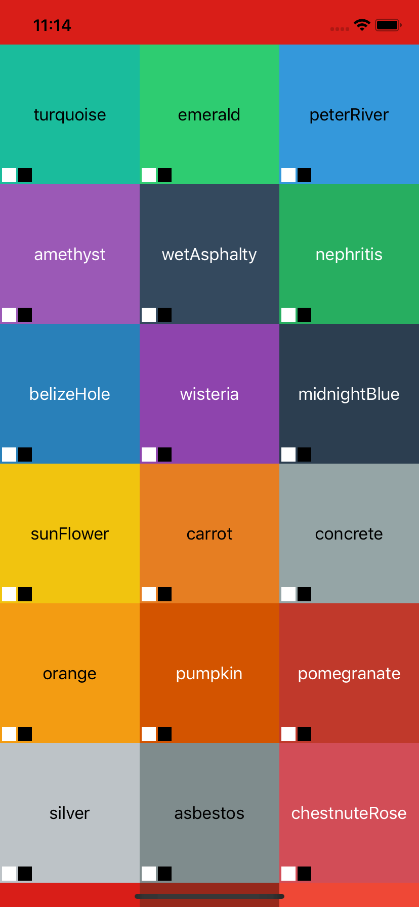
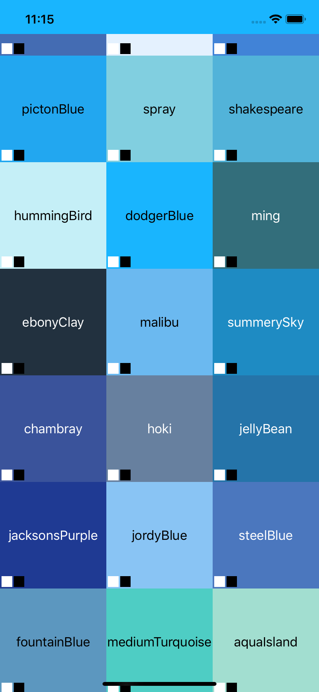
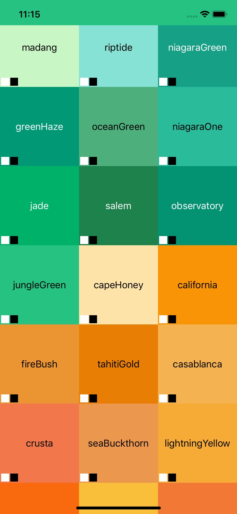
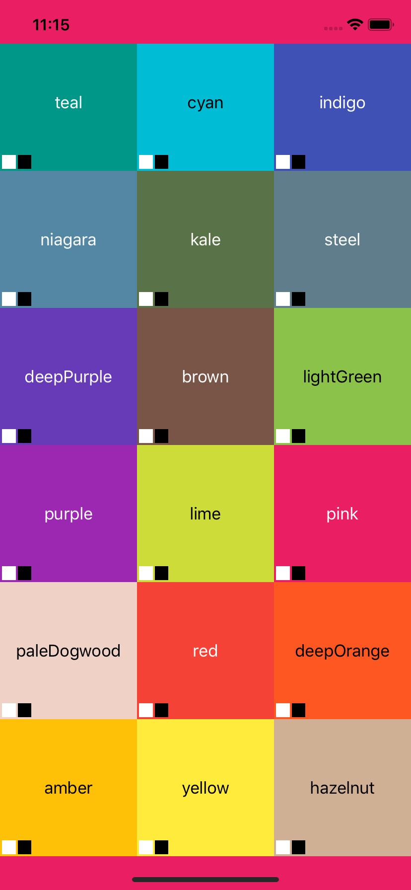

# SALFlatColors

## Flat Colors as you need
#### Class
#### Literal
#### Colorset

You can use the example to add custom color then generate the literals and the colorset.
The example also shows a grid with all the colors and a label with the suggested readable color (black or white)

|||||
| --- | --- | --- | --- |

### Run the Example to try

## License

`SALFlatColors` is released under the GNU General Public License v3.0. See LICENSE for details.
